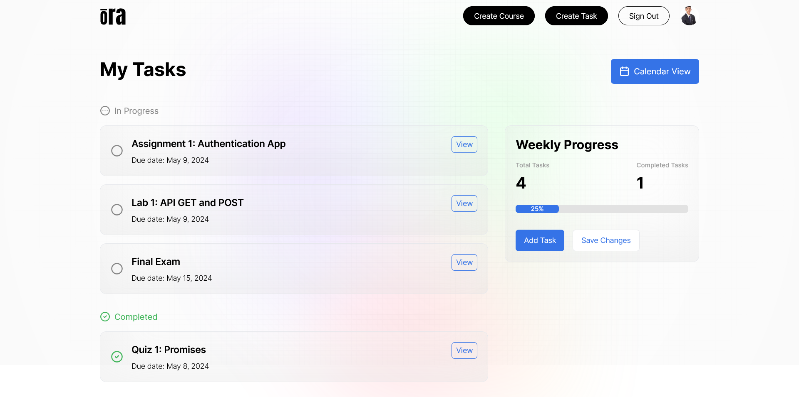
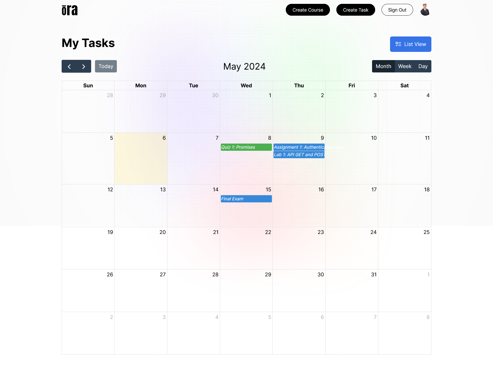
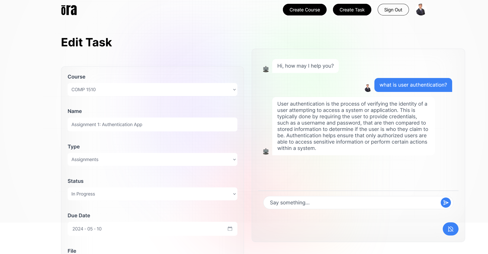
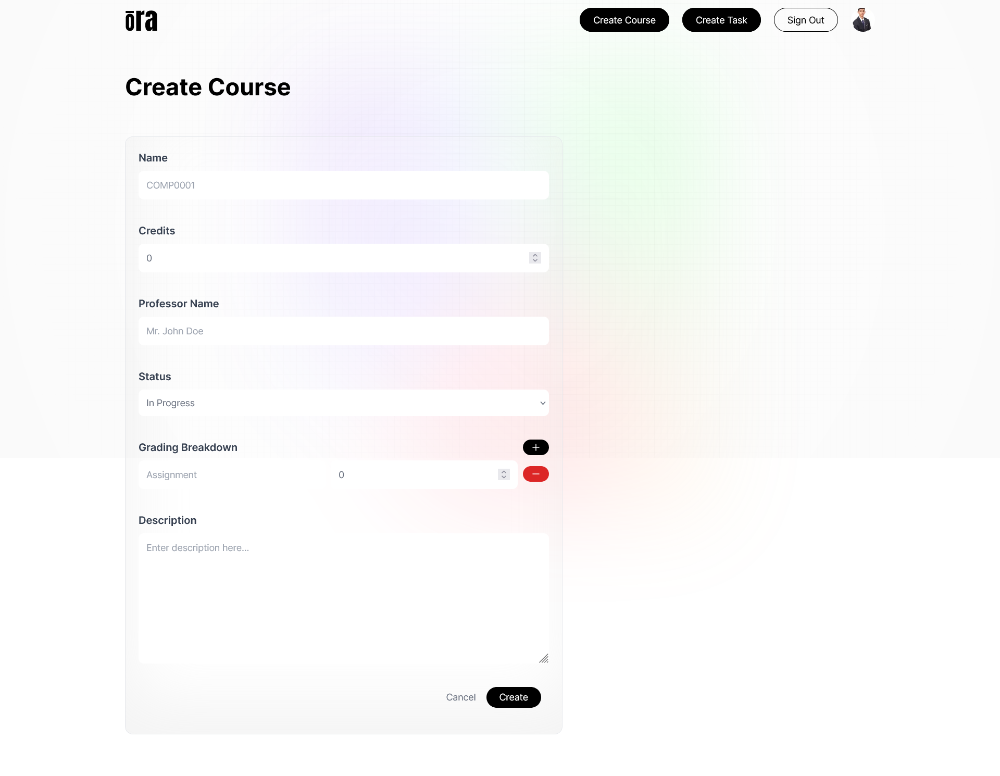
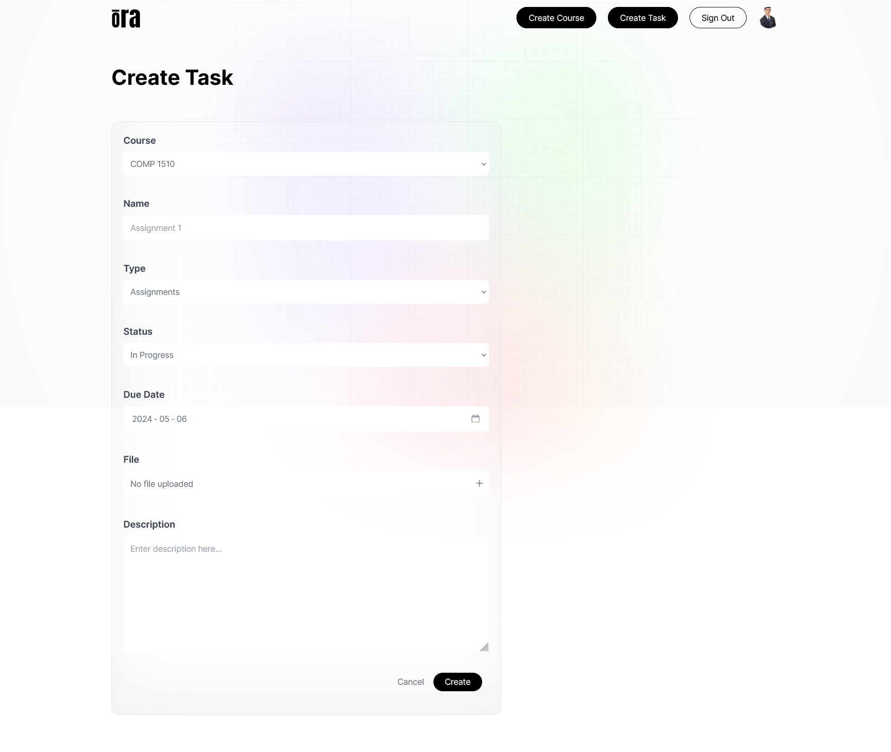

# Ora

> An AI-powered time management web application that analyzes students’ schedules, assignment deadlines, and preferences to create personalized task lists and schedules to enhance productivity and reduce stress.

_Developed by Team 15 for QDS Hacks 2024. :3rd_place_medal: Came in **3rd** place in the hackathon._ 
View the live project [_here_](https://qds-hacks-2024.onrender.com/). 
View the pitch video [_here_](https://www.youtube.com/watch?v=Gm644fFPYi8).

## Table of Contents

* [Screenshots](#screenshots)
* [Technologies](#technologies)
* [Features](#features)
* [Acknowledgements](#acknowledgements)

## Screenshots

|  |  |
|:--:|:--:|
| _Home Page_ | _Calendar Page_ |
|  |  |
| _Profile Page_ | _Edit Task Page_ |
|  |  |
| _Create Course Page_ | _Create Task Page_ |

## Technologies

* Next.js `v14.1.3`
* TailwindCSS
* MongoDB
* OpenAI GPT `GPT3.5`
* Cloudinary

## Features

* **Course and Task Management**: Create and edit courses and tasks with deadlines and weights to prioritize tasks.
* **Task Prioritization**: Ora prioritizes tasks based on deadlines and weights to create a personalized task list.
* **Calendar View**: Visualize tasks and deadlines on a calendar to better manage time and plan ahead.
* **AI Chatbot**: Facilitate natural language conversations about task requirements, deadlines, and potential questions the user has about the file attached to a task.

## Acknowledgements

* [Towa Quimbayo](https://github.com/towaquimbayo)
* [Abhishek Chouhan](https://github.com/abhishekchouhannk)
* [Mangat Toor](https://github.com/immangat)
* [Gurnoor Tatla](https://www.linkedin.com/in/gurnoortatla/)
* [Bhavnoor Saroya](https://github.com/BhavnoorSaroya)
