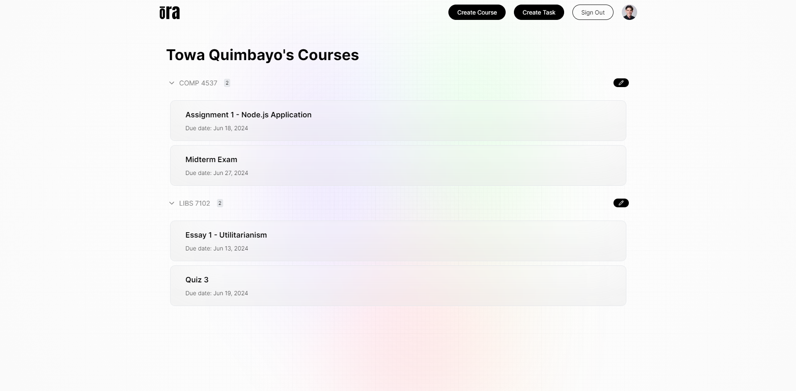

# Ora


AI-powered time-management web application designed to help students organize their tasks, such as assignments, labs, quizzes, exams, and other homework-related materials for their courses. The app enhances students' time management by analyzing schedules, assignment deadlines, and personal preferences to create personalized task lists and schedules. Ora aims to boost productivity and reduce stress by automatically prioritizing tasks based on course credits, task weight, and deadlines.

For details on the OpenAI features we created, visit our separate GitHub repository [_here_](https://github.com/abhishekchouhannk/qds2024-ai-api).

_Check out the live project [_here_](https://qds-hacks-2024.onrender.com/). Watch our pitch video [_here_](https://www.youtube.com/watch?v=Gm644fFPYi8)._

## Table of Contents

* [Screenshots](#screenshots)
* [Acknowledgements](#acknowledgements)
* [Technologies](#technologies)
* [Usage](#usage)
  * [Prerequisites](#prerequisites)
  * [Installation](#installation)
  * [Environment Variables Setup](#environment-variables-setup)
  * [Run The App](#run-the-app)
* [Features](#features)
  * [Task and Schedule Management](#task-and-schedule-management)
  * [Course and Task Management](#course-and-task-management)
  * [AI-Powered Features](#ai-powered-features)
  * [Productivity Tools](#productivity-tools)
* [Awards](#awards)

## Screenshots

|  |  |
|:--:|:--:|
| _Tasks (List View) Page_ | _Tasks (Calendar View) Page_ |
|  |  |
| _Profile Page_ | _Edit Task Page_ |
|  |  |
| _Create Course Page_ | _Create Task Page_ |

## Acknowledgements

* Mangat Toor [GitHub](https://github.com/immangat) [LinkedIn](https://www.linkedin.com/in/immangat)
* Towa Quimbayo [GitHub](https://github.com/towaquimbayo) [LinkedIn](https://www.linkedin.com/in/towa-quimbayo/)
* Noufil Saqib [GitHub](https://github.com/noufilsaqib) [LinkedIn](https://www.linkedin.com/in/muhammad-noufil-saqib/)
* Abhishek Chouhan [GitHub](https://github.com/abhishekchouhannk) [LinkedIn](https://www.linkedin.com/in/abhishekchouhannk)
* Bhavnoor Saroya [GitHub](https://github.com/BhavnoorSaroya) [LinkedIn](https://www.linkedin.com/in/bhavnoor-saroya)
* Gurnoor Tatla [LinkedIn](https://www.linkedin.com/in/gurnoortatla/)

[](https://github.com/towaquimbayo/Ora/graphs/contributors)

## Technologies

* Next.js `v14.1.3`
* React.js `v18.0.0`
* JavaScript
* Axios `v1.6.7`
* Cloudinary `v6.2.1`
* FullCalendar `v6.1.11`
* MongoDB / Mongoose `v8.2.1`
* Next-Auth `v4.24.7`
* TailwindCSS `v3.3.0`
* Node.js
* Express `v4.18.3`
* PDF-Parse `v1.1.1`
* OpenAI GPT3.5 `v4.28.4`

## Usage

<details>
  <summary>Prerequisites</summary>

### Prerequisites

* [VSCode](https://code.visualstudio.com/download/)
* [Git](https://git-scm.com/downloads/)
* [Node.js](https://nodejs.org/en/download/)

</details>

<details>
  <summary>Installation</summary>

### Installation

1. Install the latest npm package version.

  ```sh
  npm install npm@latest -g
  ```

2. Clone the repository to your local machine.

  ```sh
  git clone https://github.com/towaquimbayo/Ora.git
  ```

3. Installing required dependencies requires Node and npm.

  ```sh
  npm install
  ```

</details>

<details>
  <summary>Environment Variables Setup</summary>

### Environment Variables Setup

For the project to run correctly, environment variables are required. Rename the `.env.example` to `.env`.

1. Sign up for a MongoDB Atlas account at <https://www.mongodb.com/cloud/atlas/register>. Then create a database Cluster and connect your project to that Cluster by clicking on the `Connect`, selecting the `Connect To Your Application` option and copying the Database `URI` string as your `DATABASE_URL`. Finally, replace the `username` and `password` fields in the URI string with your database credentials.
2. Create a Google OAuth app at <https://refine.dev/blog/nextauth-google-github-authentication-nextjs/#for-googleprovider-make-sure-you-have-a-google-account/>.
3. Sign up for an OpenAI account and follow the documentation at <https://platform.openai.com/docs/quickstart?context=node> to obtain your API key and set up OpenAI.
4. Create a Cloudinary account and follow the documentation at <https://cloudinary.com/guides/front-end-development/integrating-cloudinary-with-next-js> to obtain your API credentials and setup Cloudinary with Next.js

</details>

<details>
  <summary>Run The App</summary>

### Run The App

Running the application locally or in production is straightforward since both the frontend and backend are integrated into a single Next.js application running on port 3000.

* Execute `npm run build` to build the application for production.
* Execute `npm run dev` to run locally in development mode or `npm start` to run it using the production build.

</details>

## Features

### Task and Schedule Management

Efficiently organize and manage tasks and schedules to optimize productivity.

* __Personalized Task Lists and Schedules__: The application analyzes students’ schedules and preferences to create personalized task lists and schedules, prioritizing tasks to enhance productivity and reduce stress.
* __Task Prioritization__: Using OpenAI, the application prioritizes tasks automatically by considering course credits, task weight, and deadlines, helping students focus on the most important tasks first.
* __Calendar View__: Students can view their schedules in a calendar format, drag and drop tasks to move deadlines, and create new tasks directly on the calendar.
* __Task List View__: Tasks are displayed in a list format, sectioned by courses, allowing students to manage their workload efficiently.

### Course and Task Management

Create, manage, and delete courses and tasks with detailed information.

* __Course Management__: Students can create courses and input details such as course name, credits, professor’s name, status (completed or in progress), and a description. Each course can also include a course grading breakdown for categories of tasks such as exams, quizzes, assignments, and their respective percentage weight of the grade.
* __Task Management__: For each task, students can specify the course it belongs to, the task title, type (assignment, exam, quiz, etc.), due date, and a description. Students can also upload files related to the task, such as PDF documents, to keep all relevant materials organized.

### AI-Powered Features

Leveraging OpenAI to provide smart solutions and assistance.

* __Task Prioritization__: The AI prioritizes tasks based on several factors, including course credits, task weight, and deadlines, ensuring that students focus on the most critical tasks first.
* __AI Chatbot__: An AI chatbot powered by OpenAI acts as a study buddy facilitating natural language conversations. Students can interact with the chatbot about task requirements or deadlines, upload files for analysis, and receive help with their tasks or get answers to their questions.

### Productivity Tools

Additional tools to help students stay organized and efficient.

* __File Uploads__: Students can upload and attach files to tasks, ensuring that all necessary documents are easily accessible.
* __Drag and Drop__: In the calendar view, tasks can be moved by dragging and dropping, making it easy to adjust deadlines and manage schedules on the fly.
* __Status Tracking__: Students can mark tasks and courses as completed or in progress, helping them track their progress and stay on top of their workload.

## Awards

Ora has received significant recognition for its impact and innovative use of technology. At the QDS Hacks 2024 Hackathon, we were honoured with the following award:

* :3rd_place_medal:__3rd Place__: Competing against over 300+ students, Ora stood out for its potential to enhance student health and well-being. Our AI-powered solution offers a revolutionary approach to homework time management, leveraging intelligent algorithms to prioritize tasks and reduce stress.

These awards reflect our commitment to creating a high-impact, user-friendly platform using cutting-edge technologies.

For more details, you can read our Devpost submission [here](https://devpost.com/software/ora-32wnoz).
